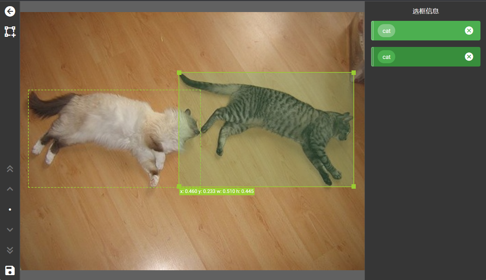

# Labelfun

Labelfun is a web tool for computer vision annotation. It supports creating datasets for image classification, image object detection and video object detection.



On Labelfun, you can:

- Upload image or videos and create annotation tasks
- Label images and videos right in your browser
- Review new annotations
- Download annotations

## Development

### Server

1. Create `server/.flaskenv` with the content below:

    ```
    FLASK_APP=labelfun
    FLASK_ENV=development
    ```

2. Provide these environment variables in `server/.env` in the format of `KEY=value`:

    | Key                     | Usage                                                        |
    | ----------------------- | ------------------------------------------------------------ |
    | `QINIU_ACCESS_KEY`      | The access key of your [Qiniu Cloud](https://www.qiniu.com/) account |
    | `QINIU_SECRET_KEY`      | The secret key of your [Qiniu Cloud](https://www.qiniu.com/) account |
    | `QINIU_BUCKET_DOMAIN`   | The domain name for you Qiniu Object Storage bucket          |
    | `QINIU_BUCKET_NAME`     | The name of your Qiniu Object Storage bucket                 |
    | `INVITATION_CODE`       | The invitation code for a new account                        |
    | `INVITATION_CODE_ADMIN` | The invitation code for an admin account                     |
    | `EXPORT_DIRECTORY`      | Where exported zip files are saved on the server             |
    | `LABELFUN_DATABASE_URL` | The MySQL database URL (use `mysqldb`)                       |

3. Under `server/`:

    ```bash
    $ python -m venv env
    
    > env\Scripts\activate  # Windows
    $ . env/bin/activate    # Linux / macOS
    
    (env) $ pip install -r requirements.txt
    (env) $ flask fakedb    # Initializes database
    (env) $ flask run
    ```

### Client

1. Provide these environment variables in `client/.env` or `client/.env.development` or `client/.env.production`:

   | Key           | Usage |
   | ------------- | ----- |
   | `VUE_APP_API` | Where API requests are sent |
   | `VUE_APP_QINIU_BUCKET_DOMAIN` | The domain name for you Qiniu Object Storage bucket |

2. Under `client/`:

    ```bash
    npm install
    npm run serve
    ```

